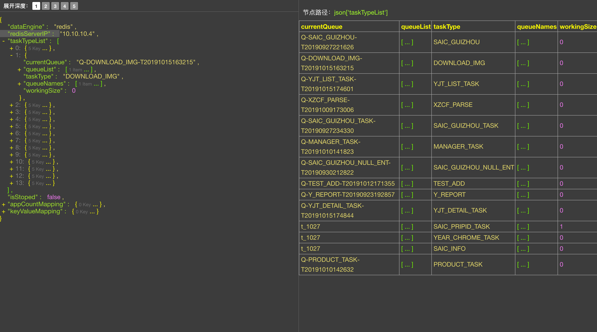

# json-json

用于展示json数据的vue插件，也可以脱离vue使用，轻量、全面，除了常规功能外，可以以列表的形式展示json数组


在线demo或使用：http://json-json.com/json
---
npm模块整理中，最终可以通过npm install json-json安装

---
*快速使用：*
```shell script
npm install --save json-json
```
```vue
<template>
  <div>
    <div style="width:500px;height:600px;">
      <JsonJson :data="json_string" />
    </div>
  </div>
</template>

<script>
import JsonJson from 'json-json'
export default {
  name: 'DocsIndex',
  components: {
    JsonJson
  },
  data() {
    return {
      json_string: '{"dataEngine":"redis","redisServerIP":"10.10.10.4","taskTypeList":[{"currentQueue":"Q-SAIC_GUIZHOU-T20190927221626","queueList":[{"queueAllSize":"438561","queueName":"Q-SAIC_GUIZHOU-T20190927221626","isCurrentQueue":true,"queueCurrentSize":0}],"taskType":"SAIC_GUIZHOU","queueNames":["Q-SAIC_GUIZHOU-T20190927221626"],"workingSize":0},{"currentQueue":"Q-DOWNLOAD_IMG-T20191015163215","queueList":[{"queueAllSize":"309077","queueName":"Q-DOWNLOAD_IMG-T20191015163215","isCurrentQueue":true,"queueCurrentSize":119807}],"taskType":"DOWNLOAD_IMG","queueNames":["Q-DOWNLOAD_IMG-T20191015163215"],"workingSize":0},{"currentQueue":"Q-YJT_LIST_TASK-T20191015174601","queueList":[{"queueAllSize":"100","queueName":"Q-YJT_LIST_TASK-T20191015174601","isCurrentQueue":true,"queueCurrentSize":0}],"taskType":"YJT_LIST_TASK","queueNames":["Q-YJT_LIST_TASK-T20191015174601"],"workingSize":0},{"currentQueue":"Q-XZCF_PARSE-T20191009173006","queueList":[{"queueAllSize":"3916161","queueName":"Q-XZCF_PARSE-T20191009173006","isCurrentQueue":true,"queueCurrentSize":269}],"taskType":"XZCF_PARSE","queueNames":["Q-XZCF_PARSE-T20191009173006"],"workingSize":0},{"currentQueue":"Q-SAIC_GUIZHOU_TASK-T20190927234330","queueList":[{"queueAllSize":"73465","queueName":"Q-SAIC_GUIZHOU_TASK-T20190927234330","isCurrentQueue":true,"queueCurrentSize":73200}],"taskType":"SAIC_GUIZHOU_TASK","queueNames":["Q-SAIC_GUIZHOU_TASK-T20190927234330"],"workingSize":0},{"currentQueue":"Q-MANAGER_TASK-T20191010141823","queueList":[{"queueAllSize":"24498","queueName":"Q-MANAGER_TASK-T20191010141823","isCurrentQueue":true,"queueCurrentSize":0}],"taskType":"MANAGER_TASK","queueNames":["Q-MANAGER_TASK-T20191010141823"],"workingSize":0},{"currentQueue":"Q-SAIC_GUIZHOU_NULL_ENT-T20190930212822","queueList":[{"queueAllSize":"365333","queueName":"Q-SAIC_GUIZHOU_NULL_ENT-T20190930212822","isCurrentQueue":true,"queueCurrentSize":365207}],"taskType":"SAIC_GUIZHOU_NULL_ENT","queueNames":["Q-SAIC_GUIZHOU_NULL_ENT-T20190930212822"],"workingSize":0},{"currentQueue":"Q-TEST_ADD-T20191012171355","queueList":[{"queueAllSize":"1","queueName":"Q-TEST_ADD-T20191012171355","isCurrentQueue":true,"queueCurrentSize":1}],"taskType":"TEST_ADD","queueNames":["Q-TEST_ADD-T20191012171355"],"workingSize":0},{"currentQueue":"Q-Y_REPORT-T20190923192857","queueList":[{"queueAllSize":"10102","queueName":"Q-Y_REPORT-T20190923192857","isCurrentQueue":true,"queueCurrentSize":0}],"taskType":"Y_REPORT","queueNames":["Q-Y_REPORT-T20190923192857"],"workingSize":0},{"currentQueue":"Q-YJT_DETAIL_TASK-T20191015174844","queueList":[{"queueAllSize":"272260","queueName":"Q-YJT_DETAIL_TASK-T20191015174844","isCurrentQueue":true,"queueCurrentSize":0}],"taskType":"YJT_DETAIL_TASK","queueNames":["Q-YJT_DETAIL_TASK-T20191015174844"],"workingSize":0},{"currentQueue":"t_1027","queueList":[{"queueAllSize":"10692","queueName":"Q-SAIC_PRIPID_TASK-T20190912111459","isCurrentQueue":false,"queueCurrentSize":1},{"queueAllSize":"48","queueName":"t_1027","isCurrentQueue":true,"queueCurrentSize":0}],"taskType":"SAIC_PRIPID_TASK","queueNames":["t_1027","Q-SAIC_PRIPID_TASK-T20190912111459"],"workingSize":1},{"currentQueue":"t_1027","queueList":[{"queueAllSize":"1170","queueName":"Q-YEAR_CHROME_TASK-T20190923164126","isCurrentQueue":false,"queueCurrentSize":5535},{"queueAllSize":"1","queueName":"t_1027","isCurrentQueue":true,"queueCurrentSize":0}],"taskType":"YEAR_CHROME_TASK","queueNames":["t_1027","Q-YEAR_CHROME_TASK-T20190923164126"],"workingSize":0},{"currentQueue":"t_1027","queueList":[{"queueAllSize":"319","queueName":"Q-SAIC_INFO-T20190919151439","isCurrentQueue":false,"queueCurrentSize":5794},{"queueAllSize":"69","queueName":"t_1027","isCurrentQueue":true,"queueCurrentSize":0}],"taskType":"SAIC_INFO","queueNames":["t_1027","Q-SAIC_INFO-T20190919151439"],"workingSize":0},{"currentQueue":"Q-PRODUCT_TASK-T20191010142632","queueList":[{"queueAllSize":"115369","queueName":"Q-PRODUCT_TASK-T20191010142632","isCurrentQueue":true,"queueCurrentSize":0}],"taskType":"PRODUCT_TASK","queueNames":["Q-PRODUCT_TASK-T20191010142632"],"workingSize":0}],"isStoped":false,"appCountMapping":{},"keyValueMapping":{}}'
    }
  },
  computed: {
  },
  mounted() {
    // 你也可以通过异步加载的方式为变量赋值，json-json会自动感知变量发生变化，从而去展示新的json数据
    // setTimeout(() => {
    //   this.json_string = '{"hi":false}'
    // }, 3000)
  },
  methods: {
  }
}
</script>
<style lang="scss" scoped>
</style>
```
*上面代码的效果：*



有问题可以加QQ：3235808353，提bug、提建议、一起交流分享前端开发心得。


